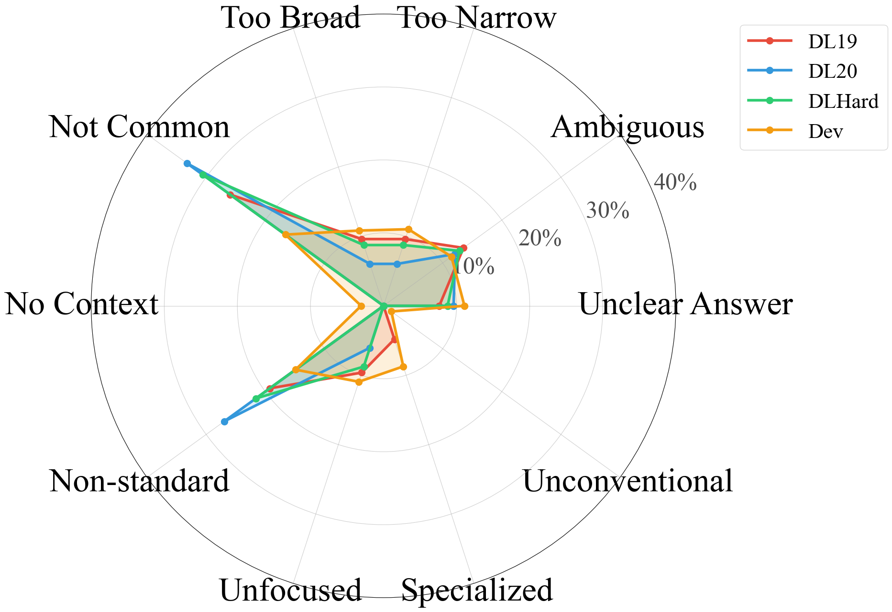
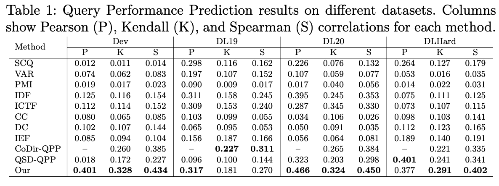

# DRAQ - Difficulty Reason Aware Query Performance

This repository implements of Difficulty Reason Aware Query Performance (DRAQ) system that leverages Large Language Model (LLM) generated reasoning signals to assess query difficulty. The system uses BERT-based models enhanced with one-hot encoded reasoning features to predict query performance on information retrieval tasks.


## Repository Architecture

The repository is organized as follows:

```
PaperRepo/
├── train.py              # Main training script
├── test.py               # Evaluation script for multiple test datasets
├── model.py              # BERT-based QPP model architecture
├── dataset.py            # Dataset loader with reasoning integration
├── oneHot_reasoning.py   # LLM-based reasoning extraction pipeline
├── few_shot_performance.py # Few-shot QPP with LLMs and FAISS retrieval
├── config.json           # Training and model configuration
├── PadCollate.py         # Custom collation for batch processing
├── losses.py             # QPP loss function (MSE)
├── utils.py              # Utility functions for metrics and timing
├── requirements.txt      # Python dependencies
├── reasoning_by_llm.zip  # Pre-generated reasoning annotations (needs extraction)
├── dataset/              # Query performance datasets
├── images/               # Visualization assets
│   ├── dataset_combine.png
│   └── results.png
└── irtools/              # Information retrieval utilities
```

### Core Components

#### Model Architecture (`model.py`)
The `DRAQ` class implements a BERT-based regression model:
- **Encoder**: Pre-trained BERT (`bert-base-uncased`) for contextual query representations
- **Regression Head**: Linear layer with sigmoid activation for performance score prediction
- **Input**: Query text concatenated with one-hot encoded reasoning signals
- **Output**: Continuous performance score (normalized between 0-1)

#### Dataset Processing (`dataset.py`)
The `Dataset` class handles:
- Loading query-performance pairs from TREC Deep Learning benchmarks
- Integration of LLM-generated reasoning annotations
- One-hot encoding expansion of reasoning features
- Support for multiple evaluation datasets (DL19-22, Dev, Hard)

#### Reasoning Generation (`oneHot_reasoning.py`)
LLM-based pipeline for extracting structured reasoning:
- Prompts LLM (Qwen 3:8B) to assess query characteristics
- Generates binary labels for 10 atomic difficulty indicators
- Supports batch processing with error handling and retry logic

## Query Difficulty Reasoning Framework

The system assesses queries based on **10 atomic difficulty indicators** derived from information retrieval literature. Each query is evaluated against these dimensions through LLM prompting:

### Reasoning Dimensions

1. **Too narrow or specific**: Query is overly constrained, limiting relevant document retrieval
2. **Too broad or vague**: Query lacks specificity, leading to diverse and potentially irrelevant results
3. **Lacks necessary context**: Query omits critical contextual information for disambiguation
4. **Ambiguous or poorly defined**: Query terms or intent have multiple interpretations
5. **Unclear topic or focus**: Query lacks a coherent information need
6. **Requires specialized knowledge**: Query assumes domain expertise not captured in general corpora
7. **Not a general knowledge query**: Query targets niche or specialized information
8. **No clear answer available**: Query seeks information that may not exist in standard collections
9. **Not a standard question**: Query format deviates from typical information-seeking patterns
10. **Unconventional format or structure**: Query uses non-standard syntax or phrasing

Each dimension is encoded as a binary feature (0/1), creating a 10-dimensional reasoning vector that augments the query representation.

## Dataset Overview



The system is trained and evaluated on TREC Deep Learning Track datasets with NDCG@10 performance labels:

- **Training**: MS MARCO training queries with MRR labels
- **Validation**: MS MARCO dev queries
- **Test Sets**: 
  - DL19, DL20, DL21, DL22 (individual years)
  - DL1920, DL2122 (combined sets)
  - DLHard (challenging queries subset)

## Prerequisites

### System Requirements
- **Python Version**: 3.10
- **GPU**: CUDA-capable GPU recommended for training

### Dependencies

Create a `requirements.txt` file with the following packages:

```
torch>=2.0.0
transformers>=4.30.0
datasets>=2.14.0
tqdm>=4.65.0
wandb>=0.15.0
numpy>=1.24.0
pandas>=2.0.0
scipy>=1.10.0
pyarrow>=12.0.0
openai>=1.0.0
faiss-cpu
sentence-transformers
```

Install dependencies:
```bash
pip install -r requirements.txt
```

## Setup and Installation

### Step 1: Environment Setup

```bash
# Create Python 3.10 environment (using conda/venv)
conda create -n draq python=3.10
conda activate draq

# Install dependencies
pip install -r requirements.txt
```

### Step 2: Extract Reasoning Annotations

The repository includes pre-generated LLM reasoning annotations in compressed format:

```bash
# Extract reasoning annotations
unzip reasoning_by_llm.zip
```

This will create the `reasoning_by_llm/` directory containing:
- One-hot encoded reasoning labels for all dataset splits
- Files named: `oneHot_reasons.<split>.qwen3:8b.oneHot-reasoning.txt`

### Step 3: Configure Weights & Biases (Optional)

The training script uses Weights & Biases for experiment tracking:

```bash
wandb login
```

Alternatively, set `mode: 'offline'` in `train.py` (line 31) to disable cloud logging.

### Step 4: Verify Dataset Structure

Ensure the `dataset/` directory contains:
- Training query MRR scores: `50/train_query_mrr.tsv`
- Validation query MRR scores: `dev_query_mrr.tsv`
- Test set NDCG scores: `dev2019_query_NDCG.tsv`, `dev2020_query_NDCG.tsv`, etc.

## Usage

### Training

Train the QPP model with reasoning augmentation:

```bash
python train.py
```

**Training Process:**
1. Loads configuration from `config.json`
2. Initializes BERT tokenizer and model
3. Loads training data with one-hot reasoning features
4. Trains for specified epochs (default: 2)
5. Saves model checkpoints to `model-query-reasons/output/`
6. Logs training metrics to Weights & Biases

**Key Hyperparameters** (in `config.json`):
- `learning_rate`: 1e-5
- `batch`: 8 (adjust based on GPU memory)
- `epochs`: 2
- `bertModel`: "bert-base-uncased"
- `num_warmup_steps`: 100

### Evaluation

Evaluate trained models on all test datasets:

```bash
python test.py
```

**Evaluation Process:**
1. Loads trained model from `model-query-reasons/`
2. Sequentially evaluates on 8 test datasets
3. Computes correlation metrics:
   - **Pearson r**: Linear correlation
   - **Kendall τ**: Rank correlation (robust to outliers)
   - **Spearman ρ**: Monotonic correlation
4. Outputs results to terminal and saves predictions to `DRAQOutPut.tsv`

**Example Output:**
```
------
dl19 -> Testing
------
  pearsonrCorrelation: 0.543
  kendalltauCorrelation: 0.398
  spearmanrCorrelation: 0.521
```

### Generating New Reasoning Annotations (Optional)

To create reasoning annotations for new queries:

```bash
python oneHot_reasoning.py
```

**Requirements:**
- Local LLM server running (Ollama with Qwen 3:8B)
- Query files in `datasets_/` directory
- Modify dataset paths in script (lines 143-147)

### Few-Shot QPP with LLMs

Run few-shot query performance prediction using an LLM and FAISS-based similar query retrieval:

```bash
python few_shot_performance.py --model qwen3:8b --output_dir results/few_shot
```

**How it works:**
1. Encodes training queries with a sentence-transformer model
2. Builds a FAISS index for fast similarity search
3. For each test query, retrieves the most similar training queries as few-shot examples
4. Prompts an LLM to predict the performance score based on the examples
5. Computes Pearson, Kendall, and Spearman correlations against ground truth

**Required arguments:**

| Argument | Description |
|---|---|
| `--model`, `-m` | LLM model name (e.g., `phi4:latest`, `qwen3:8b`) |
| `--output_dir`, `-o` | Output directory for predictions and results |

**Optional arguments:**

| Argument | Default | Description |
|---|---|---|
| `--datasets`, `-d` | all | Test datasets to evaluate (`test2019`, `test2020`, `testhard`, `testdev`) |
| `--dataset_dir` | `dataset` | Directory containing test dataset files |
| `--train_queries_path` | `datasets/queries.train_filtered.tsv` | Path to training queries TSV |
| `--train_scores_path` | `dataset/train_query_mrr.tsv` | Path to training scores TSV |
| `--embeddings_dir` | `embeddings_output` | Directory for FAISS index and embeddings |
| `--embedding_model` | `all-MiniLM-L6-v2` | Sentence-transformer embedding model |
| `--num_few_shot`, `-k` | `5` | Number of few-shot examples |
| `--batch_size` | `1` | Batch size for LLM inference |
| `--embedding_batch_size` | `256` | Batch size for creating embeddings |
| `--api_key` | `ollama` | API key for the LLM server |
| `--base_url` | `http://localhost:11434/v1` | Base URL for the LLM server |

**Examples:**

```bash
# Evaluate on specific datasets with 10 few-shot examples
python few_shot_performance.py -m phi4:latest -o results/phi4 -d test2019 test2020 -k 10

# Use a different embedding model and custom API endpoint
python few_shot_performance.py -m qwen3:8b -o results/qwen \
    --embedding_model all-mpnet-base-v2 \
    --base_url http://remote-server:11434/v1
```

**Requirements:**
- LLM server running (e.g., Ollama) at the specified `--base_url`
- Training query files and dataset files in place
- The FAISS index is built automatically on first run and cached in `--embeddings_dir`

## Results



The reasoning-augmented QPP model demonstrates improved correlation with actual query performance across multiple TREC Deep Learning benchmarks, particularly on challenging query subsets (DLHard).

## Configuration

The `config.json` file controls all experimental parameters:

```json
{
  "learning_rate": 1e-5,
  "dataPath": "./dataset/",
  "outputPath": "./model-query-reasons/",
  "bertModel": "bert-base-uncased",
  "seed_val": 42,
  "epochs": 2,
  "batch": 8,
  "num_warmup_steps": 100,
  "hidden_dropout_prob": 0.1
}
```

## Implementation Details

### Loss Function
Mean Squared Error (MSE) between predicted and actual performance scores:
```python
Loss = MSE(predicted_score, actual_ndcg)
```

### Optimization
- **Optimizer**: AdamW with weight decay
- **Learning Rate Schedule**: Linear warmup followed by linear decay
- **Gradient Clipping**: Max norm of 1.0

### Data Augmentation
Queries are augmented with reasoning features via string concatenation:
```
augmented_query = original_query + " " + "0 1 0 1 0 0 1 0 0 0"
```

## Troubleshooting

### Common Issues

1. **CUDA Out of Memory**
   - Reduce batch size in `config.json`
   - Use gradient accumulation (requires code modification)

2. **Missing Dataset Files**
   - Ensure `dataset/` directory contains all required `.tsv` files
   - Check file paths in `dataset.py` lines 150-167

3. **Reasoning Files Not Found**
   - Verify `reasoning_by_llm.zip` has been extracted
   - Check file naming convention matches `get_reasons_ds()` in `dataset.py`

4. **Wandb Authentication**
   - Run `wandb login` or set mode to 'offline' in `train.py`

